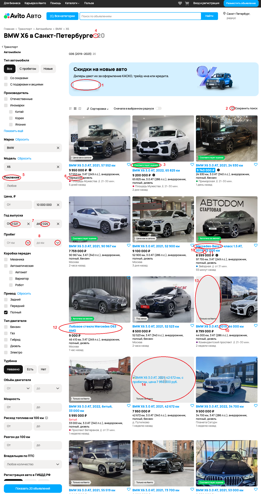

## Список багов со скриншота страницы Авито

 1. Отсутствует название кнопки на баннере. Приоритет - high.

2. Иконка «Сохранить поиск» совпадает с общепринятой иконкой «Избранное». Приоритет — low.

3. Смещена иконка с текстом «Соответствует оценке» (второе объявление, первая строка). Приоритет - medium.

4. Количество автомобилей в заголовке «Купить BMW X6 в Санкт-Петербурге» отображается со знаком «-». Приоритет - low.

5. Орфографическая ошибка в название поля «Покление». Следует написать «Пок**о**ление». Приоритет - high.

6. Отображается объявление с передним приводом при фильтре «Привод» - «Полный» (первый ряд, первое объявление). Приоритет - high.

7. В поле фильтра «Год выпуска» год отображается с разделением на тысячи. Приоритет — low.

8. В поле фильтрации «Пробег» использован выпадающий список. Должно быть поле для ввода числового значения. Приоритет - medium.

9. Отображается объявление Mercedes-Benz  с фильтром «Марка»  BMW (второй ряд третий, третье объявление). Приоритет - high.

10. Отображаются объявления с годом выпуска 2019 с фильтром «Год выпуска» - «От 2021». (второй ряд, третье объявление; третий ряд, третье объявление). Приоритет - high.

11. Отсутствует запятая после года выпуска в описании автомобиля (второй ряд, третье объявление). Приоритет — low.

12. Отображается объявление из другого раздела (третий ряд, первое объявление). Приоритет - high.

13. Сдвинуто изображение вправо в объявлении (третий ряд, третье объявление).  
Приоритет - high.

14. Не отобразилась изображение в объявлении (четвертый ряд, второе объявление). Приоритет - high.
